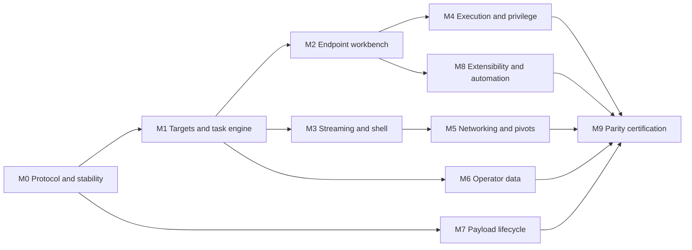

# Sliver GUI Operator Roadmap

- Status: living document
- Scope: remote Sliver operator workflows
- Parity baseline: Sliver commit `9ff9b55352eb1c8f2ff6a906bb691e9cee5bcaa9`
- Last command-tree audit: 2026-08-09
- Target desktop platforms: macOS arm64 and x64 (universal package), Windows
  x64, Linux x64

## Purpose

This roadmap defines the work required for Sliver GUI to reach practical
feature parity with the remote Sliver terminal client under `./sliver/client`.
Parity means that an operator can accomplish the same supported workflows with
equivalent inputs, results, target restrictions, and safety controls. It does
not mean embedding the terminal client, copying its TUI, or exposing a text box
that passes arbitrary commands to a subprocess.

This is an **operator application**. Server administration is deliberately not
part of the initial parity target. The GUI may display the connected server's
version, capabilities, and online operator presence, but it will not create,
delete, kick, or modify operators; configure multiplayer access; manage the
server process; administer certificate authorities; or expose other local
`sliver-server` console functions.

The authoritative interactive parity sources are the registered remote-client
command trees, not the presence of Go packages or helper functions:

- [`client/command/server.go` at the pinned baseline](https://github.com/BishopFox/sliver/blob/9ff9b55352eb1c8f2ff6a906bb691e9cee5bcaa9/client/command/server.go)
- [`client/command/sliver.go` at the pinned baseline](https://github.com/BishopFox/sliver/blob/9ff9b55352eb1c8f2ff6a906bb691e9cee5bcaa9/client/command/sliver.go)

Root client modes such as config import and stdio MCP are audited separately
from [`client/cli/cli.go` at the pinned baseline](https://github.com/BishopFox/sliver/blob/9ff9b55352eb1c8f2ff6a906bb691e9cee5bcaa9/client/cli/cli.go).

The baseline must be updated deliberately. A newer Sliver checkout does not
silently expand this roadmap until its reachable command trees and protobuf
changes have been audited.

## How to use this document

Milestone status uses the following values:

- **Next**: the next dependency-complete milestone.
- **Not started**: planned but not ready to begin.
- **In progress**: implementation has started and an owner should be recorded.
- **Awaiting operator acceptance**: implementation and technical exit checks are
  complete, but the next milestone remains locked until the operator tests and
  accepts the current application.
- **Blocked**: a named upstream, protocol, dependency, or design decision blocks
  further work.
- **Complete**: all exit criteria pass on the required test matrix.
- **Deferred**: still in operator scope, but intentionally postponed.
- **Operator out of scope**: an administrative or unreachable console feature
  that is not part of this product's parity target.

When a milestone changes status, update its checklist, exit-criteria evidence,
and the parity manifest described below. A feature is not complete merely
because a renderer page exists; the complete path is renderer -> preload ->
trusted IPC -> main-process domain service -> typed Sliver RPC -> reconciled
state, with relevant tests at each boundary.

## Scope contract

### In scope

- Operator configuration discovery, import, selection, switching, and safe
  local handling.
- Read-only server compatibility and online operator-presence information.
- Jobs, listeners, websites, HTTP C2 profiles, and shared network resources
  accessible to remote operators.
- Implant generation, profiles, builds, staging, encoders, and external-builder
  discovery.
- Session and beacon discovery, interaction, lifecycle, reconfiguration, and
  asynchronous beacon task handling.
- Target reconnaissance, filesystem, processes, services, execution,
  privileges, networking, pivots, forwarding, SOCKS, and interactive shells.
- Loot, credentials, hosts, IOCs, cracking workflows, reactions, canary alerts,
  and operator-triggered threat monitoring.
- Dynamic aliases, extensions, Armory packages, WASM modules, and their
  target-aware invocation.
- Local operator settings, documentation, licenses, update/version reporting,
  saved workflows, AI conversations when the server is already configured, and
  the client-side MCP surface.
- Session-versus-beacon behavior, OS/architecture/transport gating, local file
  inputs and outputs, confirmations, reconnect behavior, and multiwindow state.

### Operator out of scope

The following are intentionally excluded from the initial roadmap, even if a
related function exists in a local server console or supporting package:

- Creating, deleting, kicking, enabling, disabling, or changing the privileges
  of operators.
- Creating operator configuration bundles or issuing/revoking operator
  certificates.
- Enabling or configuring the multiplayer server listener.
- Starting, stopping, upgrading, backing up, restoring, or otherwise
  administering the Sliver server process or its storage.
- Configuring certificate authorities or exposing general certificate
  administration.
- Configuring server-side AI providers or threat-monitor providers. The GUI may
  use an already configured provider and report when one is unavailable.
- The reachable bulk `clean` command, which kills/removes all sessions,
  beacons, implant builds, and implant profiles. Resource-specific cleanup and
  dead-state pruning remain available with shared-scope warnings.
- Read-only certificate and certificate-authority inventory. Although registered
  by the remote client, it is classified as administrative security inventory
  rather than an initial target/C2 operator workflow. Issuance, revocation, and
  authority mutation are also excluded.
- Local `sliver-server` commands such as `multiplayer`, `new-operator`,
  `kick-operator`, and `ai-config`.
- Unregistered or currently unreachable helpers, including the generated but
  unattached `canaries` command and unregistered monitor-provider commands.
- The currently nonfunctional `taskmany` subcommand tree. A reliable GUI-native
  multi-target workflow may be designed later without reproducing that stub.
- Cobra help layout, ANSI tables, readline bindings, terminal themes, shell
  completion, or identical key bindings.
- Individual names supplied by third-party alias or extension packages. The
  generic secure installation and execution mechanisms are in scope.

### Conditional parity

Some operator workflows require infrastructure that may not be present:

- external builders;
- crackstations and their assets;
- server-configured AI and monitoring providers;
- WireGuard implant/listener capabilities (independent of the desktop-to-server
  operator transport);
- runtime-installed aliases, extensions, and Armory packages;
- OS- or architecture-specific implant capabilities.

These workflows are parity-complete when the GUI discovers the dependency,
exposes the supported configuration and action, applies the same runtime
restrictions as the client, and gives a useful unavailable state when the
dependency is absent. Completion requires tests for both dependency-present
success and dependency-absent or degraded behavior.

## Current baseline

The current application already provides the first operator slices:

- [x] Sandboxed Electron renderer with context isolation and no direct Node.js,
  filesystem, or network access.
- [x] Strict Content Security Policy, navigation denial, trusted-frame IPC
  checks, and a frozen typed preload API.
- [x] Native operator-config selection and safe main-process ownership of
  tokens, certificates, keys, and full paths.
- [x] Multiple windows connected to the same or different backends, with shared
  ref-counted backend connections and per-window contexts.
- [x] Live server events, recent event summaries, invalidation-driven refresh,
  and periodic reconciliation.
- [x] Job listing and stop-one/stop-all operations.
- [x] mTLS, WireGuard, DNS, HTTP, HTTPS, and TCP staging listener forms.
- [x] Session and beacon implant generation with core target, C2, timing,
  hardening, limit, canary, HTTP-profile, WireGuard, and shellcode options.
- [x] Build/profile/staging inventory and core create, generate, download,
  delete, and replace operations.
- [x] Native save dialogs for generated and archived artifacts.
- [x] Cross-platform package-build and tagged-release workflow definitions.
- [ ] Authoritative session and beacon state.
- [ ] Generic operator action and beacon task engine.
- [ ] Interactive terminal and bounded tunnel streaming.
- [ ] Broad terminal-client operator feature coverage.

Packaged operator transport is currently mTLS-only. WireGuard operator
configurations are discovered and shown with an explicit deferred/unavailable
state, but cannot connect. Per the 2026-08-09 scope decision, native WireGuard
operator transport packaging is deferred beyond M0 and is not a release gate.
WireGuard listeners and implant C2 remain separate supported operator features.

Important implementation seams:

- Shared DTOs and IPC channels: [`src/shared/contracts.ts`](src/shared/contracts.ts)
- Frozen preload bridge: [`src/preload/index.ts`](src/preload/index.ts)
- Trusted IPC registration: [`src/main/ipc.ts`](src/main/ipc.ts)
- Per-window contexts and backend pooling:
  [`src/main/connection-registry.ts`](src/main/connection-registry.ts)
- Renderer security policy: [`src/main/security.ts`](src/main/security.ts)
- Vendored TypeScript Sliver client:
  [`vendor/sliver-script/src/client.ts`](vendor/sliver-script/src/client.ts)

## Engineering principles

### 1. Direct typed RPCs, never terminal passthrough

The Electron main process will call generated Sliver RPCs through typed domain
services. Client-side logic that currently exists only in Go should be ported
and verified with golden fixtures. The GUI must not spawn `sliver-client`, parse
terminal output, or treat CLI strings as a stable API.

### 2. Preserve the Electron security boundary

- The renderer remains sandboxed and receives only sanitized DTOs.
- Raw gRPC clients, operator credentials, private keys, filesystem paths,
  arbitrary protobufs, and unrestricted tunnel handles stay in Electron main.
- Files enter or leave through native dialogs and unguessable main-process
  capability handles. Each handle is bound to its owning window, backend,
  operation, permitted action, and explicit lifetime; it is revoked on
  operation, window, or backend teardown.
- Downloaded packages may not execute JavaScript in the renderer.
- Renderer networking remains disabled. Narrow CSP changes are allowed only for
  packaged local terminal WASM/worker assets.
- Every new IPC channel validates input, exact frame ownership, connection
  ownership, current target identity, window/operation ownership, and output
  bounds.

### 3. Separate summaries, operations, and streams

Do not grow the current global snapshot into a container for tasks, loot,
credentials, file content, or tunnel bytes.

- **Summary plane:** cheap normalized state such as connection health, jobs,
  target presence, build metadata, and unread-event counts.
- **Operation plane:** typed requests with request IDs, timeouts, cancellation,
  progress, result dispositions, and beacon task correlation.
- **Streaming plane:** bounded MessagePort or transferable-chunk streams for
  shells, tunnels, and file transfers when the upstream RPC supports chunking,
  with backpressure and lifecycle ownership. Existing unary file RPCs remain
  main-only, use hard size caps and temporary files, and are not described as
  true network streaming.

### 4. Make target capabilities authoritative

One main-process capability service must combine:

- server and protobuf version;
- session versus beacon;
- target OS and architecture;
- C2 transport, including WireGuard-specific features;
- external builder/provider availability;
- runtime checks that are stricter than command annotations.

Renderer components consume capability descriptions; they do not independently
reimplement platform rules.

### 5. Keep shared and per-window state distinct

Backend summaries and server events may be shared across windows using the same
operator configuration. Active target, pending local operations, open shell
attachments, native dialogs, and tunnel ownership remain per-window. Window
destruction must deterministically cancel or detach its resources.

### 6. Deliver vertical slices

Each feature pull request should normally include:

1. generated-client or domain-service support;
2. shared request, response, and capability DTOs;
3. strict input decoding and trusted IPC registration;
4. backend state mutation/reconciliation behavior;
5. renderer workflow and accessible error/loading/empty states;
6. unit and contract tests;
7. Electron or real-server coverage proportional to risk;
8. parity-manifest and roadmap updates.

### 7. Keep administration absent, not merely hidden

Operator-only scope is enforced at the application boundary:

- The shared contract and preload API use an allowlist of operator actions.
- No operator-account mutation, certificate-authority administration,
  multiplayer setup, server-process control, or global-server-clean action may
  have a renderer route, DTO, IPC channel, or main-process handler.
- Generated RPC availability alone never authorizes exposing an action.
- Only compiled, reviewed main-process code may associate an operation with an
  RPC, capability rules, idempotency class, confirmation policy, or result
  disposition. Renderer input, packages, AI output, and MCP clients cannot
  create raw operation descriptors or select arbitrary RPC methods.
- Read-only server compatibility and operator-presence summaries use narrow
  sanitized DTOs rather than raw administrative protobufs.
- Contract tests enumerate the complete preload API and fail if an
  administrative channel is accidentally added.
- Any future administrative product must receive a separate threat model,
  explicit authorization decision, navigation surface, and release plan. It is
  not an implicit extension of this roadmap.

### 8. Maintain one accessible desktop design system

- Use HeroUI and HeroUI Pro components consistently for forms, overlays, data
  grids, navigation, and feedback.
- Use locally bundled Font Awesome Free SVG icons; do not add remote icon or
  font dependencies.
- Keep primary forms scrollable with stable action areas, clear validation, and
  explicit loading, empty, degraded, and error states.
- Use searchable/virtualized data views for large inventories rather than
  rendering unbounded tables.
- All destructive actions use accessible confirmation dialogs that identify
  the backend, target, and resource being changed.
- All primary workflows must be keyboard-operable and preserve useful focus
  after dialogs, refreshes, errors, and navigation.

## Milestone overview

| Milestone | Outcome | Status | Estimate |
| --- | --- | --- | --- |
| M0 | Reproducible protocol baseline and stable current features | **Complete** | 4-6 weeks |
| M1 | Sessions, beacons, target state, and generic task execution | **Next** | 3-5 weeks |
| M2 | Core endpoint reconnaissance, files, and processes | Not started | 4-6 weeks |
| M3 | Bounded streaming, managed shells, and tunnel lifecycle | Not started | 3-5 weeks |
| M4 | Execution, post-exploitation, and privilege workflows | Not started | 4-6 weeks |
| M5 | Forwarding, SOCKS, WireGuard networking, and pivots | Not started | 4-5 weeks |
| M6 | Operator data, collaboration, monitoring, and cracking | Not started | 4-6 weeks |
| M7 | Complete payload, profile, build, and encoder lifecycle | Not started | 3-5 weeks |
| M8 | Extensions, Armory, automation, AI, and MCP | Not started | 5-8 weeks |
| M9 | Long-tail parity and cross-platform certification | Not started | 4-6 weeks |

Milestone governance is tracked separately from checklist state:

| Milestone | Owner | Last reviewed | Decision/ADR links | Exit evidence |
| --- | --- | --- | --- | --- |
| M0 | Codex / operator accepted | 2026-08-09 | [ADR 0001](docs/adr/0001-platform-support.md) | [M0 verification](docs/m0-verification.md) |
| M1 | Unassigned | 2026-08-09 | TBD | TBD |
| M2 | Unassigned | 2026-08-09 | TBD | TBD |
| M3 | Unassigned | 2026-08-09 | TBD | TBD |
| M4 | Unassigned | 2026-08-09 | TBD | TBD |
| M5 | Unassigned | 2026-08-09 | TBD | TBD |
| M6 | Unassigned | 2026-08-09 | TBD | TBD |
| M7 | Unassigned | 2026-08-09 | TBD | TBD |
| M8 | Unassigned | 2026-08-09 | TBD | TBD |
| M9 | Unassigned | 2026-08-09 | TBD | TBD |

After M0, M7 payload work may proceed alongside M1 because its current artifact
primitives already exist. After M1, M2/M4, M3/M5, and M6 can proceed as three
parallel tracks while M7 continues. Core M8 alias/extension work can begin after
the M1 task engine and M2 safe-file layer; specific extension types may
additionally depend on M3, M4, M5, or M7. M9 integrates all tracks.



## M0 - Protocol baseline and current-feature stability

- Status: **Complete**
- Dependencies: none

M0 has two separately owned gates: protocol/provenance and current-feature
safety/application coverage. Work may overlap, but M1 does not begin until
every non-deferred M0 exit criterion passes and the operator accepts the
milestone.

### Protocol and parity inventory

- [x] Add a generated, checked-in operator parity manifest derived from the two
  registered remote-client command trees and the separately audited root-client
  modes.
- [x] Fetch and verify the exact pinned upstream commit for manifest generation;
  tooling must not assume the ignored adjacent `./sliver` checkout exists.
- [x] Reconcile and correct the two current provenance baselines: operator parity
  targets Sliver `9ff9b553...`, while `vendor/sliver-script/VENDORED.md`
  attributes the generated protobuf source to Sliver `4ef8644...`. The checked
  generated API contains fields newer than that declared protobuf source, so
  provenance must be proven by byte/semantic regeneration rather than merely
  recording both hashes.
- [x] Give every reachable command node one of: `planned`, `in-progress`,
  `complete`, `deferred`, `operator-out-of-scope`, `upstream-blocked`, or
  `unreachable`.
- [x] Record command restrictions, dependencies, meaningful modes/options,
  target milestone, owning GUI surface, and test identifiers.
- [x] Make protobuf and TypeScript client generation reproducible from the
  pinned Sliver baseline, or document and verify every intentional schema delta.
- [x] Pin the protobuf compiler, TypeScript generator, plugin options, Node/npm
  toolchain, formatting step, and generated-file ordering.
- [x] Preserve handwritten client-wrapper changes as an explicit reviewed patch
  layer that can be reapplied after regeneration.
- [x] Add CI that reports generated API/schema drift when the baseline changes.
- [x] Add server-version and capability negotiation with explicit supported,
  degraded, and unsupported states.
- [x] Record a platform-support ADR with exact minimum/tested macOS versions for
  arm64 and x64, Windows x64 releases, and Linux distribution/glibc baselines.

### Current-feature corrections

- [x] Fix scheme-less C2 endpoint behavior so UI copy, validation, profile
  storage, and protobuf mapping agree on the default transport.
- [x] Handle rejection from periodic and event-triggered refreshes; transition
  the connection into a visible degraded or disconnected state rather than
  leaving an unhandled promise rejection.
- [x] Replace hardcoded compiler-target fallback with explicit loading, empty,
  failure, and unsupported states.
- [x] Harden existing stop-one/stop-all job actions with exact backend, job,
  listener, and shared-operator impact summaries. Stop-all enumerates the
  affected current resources and requires explicit destructive confirmation.
- [x] Split broad snapshot refreshes into normalized per-domain stores and
  targeted invalidation.
- [x] Assign every backend connection an epoch/generation. Cancel superseded
  refreshes and reject responses from an older epoch so a slow pre-reconnect
  request cannot overwrite authoritative post-reconnect state.
- [x] Continue treating events as invalidation hints rather than ordered
  authoritative history; every reconnect obtains fresh authoritative state.
- [x] Define pagination and bounded result contracts before adding large domain
  inventories.
- [x] Replace the vendored client's approximately 2 GiB generic gRPC allocation
  limits with justified per-domain transport budgets. Reject oversized
  messages before protobuf decoding or renderer structured cloning.
- [x] Finish operator-config import, local naming, selection, switching, and
  removal while keeping contents and full paths in main.
- [x] Delete only GUI-managed imported copies. Externally selected files and
  pre-existing `~/.sliver-client/configs` entries are forgotten/detached unless
  the operator separately confirms filesystem deletion.
- [x] Verify imported config permissions without logging secrets or contents.
- [x] Apply bounded regular-file validation to native-selected configs and every
  referenced certificate/key file before reading them; reject links and
  oversized inputs and zeroize secret buffers after use.
- [x] Replace raw `event.Data` summaries with a typed allowlist/redactor so raw
  task, credential, loot, or arbitrary event bytes never enter shared snapshots.

### Current-slice application coverage

- [x] Make the Sliver client injectable in registry tests.
- [x] Add fake-client tests for pool sharing/refcounts, listener dispatch,
  generation, build/profile mutations, event invalidation, refresh failure,
  connection epochs, and disconnect cleanup.
- [x] Add at least one Electron current-slice E2E covering renderer -> preload ->
  IPC -> registry rather than constructing `SliverClient` directly.
- [x] Add one packaged application smoke covering config selection, connection,
  an existing read, and a safe current-slice mutation.
- [x] Exercise the direct client and the freshly packaged production application
  against an actual isolated Sliver server, including resource cleanup.

### Deferred: WireGuard operator transport

- [x] Record the 2026-08-09 scope decision that WireGuard-enabled operator
  configurations are not part of M0.
- [x] Keep WireGuard configurations visible but unavailable with an explicit
  deferred reason; reject both saved-catalog and native-selected bypass paths.
- [ ] Future milestone: replace development-time Go helper compilation with
  pinned, prebuilt native helpers, checksums, lifecycle handling, package
  inclusion, and command/background reliability tests before enabling this
  transport.

### M0 exit criteria

- [x] Every reachable baseline command is classified in the parity manifest.
- [x] Generated client code and provenance are reproducible from the recorded
  source/toolchain plus the reviewed handwritten patch layer.
- [x] No background refresh path can produce an unhandled rejection.
- [x] Connection health accurately distinguishes connected, degraded,
  reconnecting, disconnected, and incompatible states.
- [x] Compiler failure never appears as a fabricated supported-target list.
- [x] Stale refresh responses from a superseded connection epoch are rejected.
- [x] Oversized RPC messages fail within the configured allocation budget before
  protobuf decode or renderer delivery.
- [x] Raw event/task bytes and unbounded config/key files cannot enter shared
  application state.
- [x] Existing stop-one/stop-all actions have shared-resource confirmation and
  regression coverage.
- [x] Registry fake-client coverage and the current-slice Electron/package smoke
  pass.
- [x] Existing unit, typecheck, build, packaging, and release-content checks
  pass.
- [x] The operator tested and explicitly accepted M0 on 2026-08-09, unlocking
  M1.

## M1 - Sessions, beacons, targets, and task execution

- Status: **Next**
- Dependencies: M0

### Authoritative target state

- [ ] Add normalized session and beacon stores populated by initial refresh,
  events, explicit refresh, and reconnect reconciliation.
- [ ] Add filterable session and beacon dashboards with status, identity,
  operating system, architecture, transport, remote address, last check-in,
  timing, and active-task summaries.
- [ ] Add a target detail surface and a per-window active-target selector.
- [ ] Support target selection, backgrounding, rename, kill/close, beacon
  removal, session/beacon dead-state pruning, beacon watch, and beacon
  reconfiguration where the remote client permits them.
- [ ] Support beacon-to-session interactive conversion over the available C2
  options.
- [ ] Show read-only online/offline operator presence plus the current window's
  backend and target-selection context without implying server-enforced target
  ownership.

### Generic operation engine

- [ ] Define an operation descriptor containing RPC/action identity, request
  encoder, response decoder, session/beacon mode, capability constraints,
  timeout policy, cancellation policy, idempotency/reconciliation class,
  confirmation policy, and result disposition.
- [ ] Allow automatic retry only for idempotent reads or operations backed by a
  server-supported idempotency key. Never automatically retry an unconfirmed
  mutation.
- [ ] Assign every invocation a request ID and owning window.
- [ ] Support synchronous session responses and asynchronous beacon task IDs
  through one UI model.
- [ ] Add beacon task list, detail, fetch, cancellation, history, and typed
  response decoding.
- [ ] Recover locally initiated pending tasks after navigation and reconnect.
- [ ] Display non-locally initiated results without claiming local ownership.
  Attribute an actor only when verified event/protocol metadata supplies one;
  otherwise label the actor as unknown.
- [ ] Add operation progress, timeout, best-effort cancellation, partial-result,
  outcome-unknown, and target-disappeared states. A timeout or disconnect after
  submission is `outcome-unknown` until task/resource reconciliation proves the
  result; resubmission requires an explicit decision.
- [ ] Add standard dispositions for inline text/table, structured detail,
  native save, loot save, binary preview, and stream attachment.

### M1 exit criteria

- [ ] A representative read and mutation work synchronously on a session and
  asynchronously on a beacon.
- [ ] Task completion remains visible after navigation and reconnect.
- [ ] Beacon task cancellation is verified against a real server.
- [ ] Two windows sharing a backend maintain independent active targets and
  operation ownership.
- [ ] Operator-presence events cannot mutate account state from the GUI.
- [ ] Target capability changes update available actions without restarting the
  application.
- [ ] Duplicate-request, timeout-after-submission, cancellation-race, and
  outcome-reconciliation fault tests pass for reads and mutations.
- [ ] The compiled operation registry contains no data-driven arbitrary-RPC
  selector, and renderer IPC cannot invoke an unregistered or excluded
  administrative method. Package, AI, and MCP adapter-specific enforcement is
  added when those adapters land in M8.

## M2 - Core endpoint workbench

- Status: Not started
- Dependencies: M1

Read-only inventory and reconnaissance should land before broad mutation and
execution. File-transfer primitives must land before editors, dump-to-file,
remote-loot collection, and WASM memory-file workflows.

### System and identity

- [ ] Ping, process ID, user ID, group ID, username, and target information.
- [ ] Environment list/set/unset with sensitive-value handling.
- [ ] Screenshot with bounded preview, native save, and optional loot save.
- [ ] Windows registry read, list, hive read, write, create, and delete with
  platform gating and destructive confirmation.

### Filesystem

- [ ] File browser with paginated or virtualized directory results.
- [ ] `pwd`, `cd`, list, cat, head, tail, grep, copy, move, mkdir, and remove.
- [ ] Upload and download through native dialogs and main-owned temporary files.
- [ ] For current unary upload/download RPCs, enforce hard request/response caps,
  main-only buffers or temporary files, pre/post-transfer status, checksum
  reporting, and safe filename handling.
- [ ] Mark true network chunking, byte-progress, and mid-transfer cancellation
  `upstream-blocked` unless a supported chunked RPC exists; do not simulate
  streaming by repeatedly cloning large buffers through renderer IPC.
- [ ] Text editor with encoding and overwrite confirmation.
- [ ] Hex editor with explicit size limits and patch-oriented writes.
- [ ] Mount inventory and in-memory file add/remove workflows.
- [ ] `chmod`, `chown`, and `chtimes` with OS-aware validation.

### Processes and services

- [ ] Process list, filters, full detail, and process tree.
- [ ] Process dump to native save or loot without buffering the entire artifact
  in renderer memory.
- [ ] Process termination with identity summary and confirmation.
- [ ] Windows service info/start/stop against supported hosts.

### M2 exit criteria

- [ ] At least one command from each system, filesystem, transfer, process, and
  service family works on sessions and beacons where supported.
- [ ] Downloads, uploads, screenshots, and process dumps remain outside global
  snapshots, obey documented unary caps, and fail safely before exceeding the
  main-process budget.
- [ ] Target restrictions are enforced in main even if renderer state is stale.
- [ ] Unary transfer tests cover pre-submit cancellation, timeout/late response,
  target loss, filename collision, native-dialog cancellation, and temporary
  cleanup. After submission, timeout is `outcome-unknown`; no partial destination
  is published, and a late response cannot overwrite newer operator intent.
- [ ] Renderer action tests cover success, empty, loading, error, and
  confirmation states.

## M3 - Streaming, managed shells, and tunnel lifecycle

- Status: Not started
- Dependencies: M1

### Streaming plane

- [ ] Add a main/preload streaming API using MessagePort or transferable bounded
  chunks rather than one IPC invocation per byte.
- [ ] Define stream IDs, window ownership, write serialization, backpressure,
  idle timeouts, and close reasons.
- [ ] Use credit-based flow control with bounded control frames, fair scheduling,
  and enforced quotas for bytes and concurrent streams at the per-stream,
  per-window, per-backend, and whole-process levels.
- [ ] Reject data and control writes after terminal close; a group of
  individually bounded streams must not exhaust the main process.
- [ ] Ensure renderer destruction, backend disconnect, target loss, and explicit
  cancellation deterministically close or safely detach streams.
- [ ] Add streaming metrics that reveal counts and pressure without logging
  content.

### Managed terminal

- [ ] Integrate Ghostty Web from packaged local assets.
- [ ] Add shell start, list, attach, detach, kill, and tab management.
- [ ] Forward terminal resize for supported Linux/macOS PTYs and expose the
  correct non-PTY behavior elsewhere.
- [ ] Preserve shell ownership across navigation and allow intentional
  detach/reattach within the owning window.
- [ ] Add accessible keyboard/focus behavior and explicit copy/paste controls.
- [ ] Treat terminal output as hostile. Disable or mediate OSC 52 clipboard
  writes, URI opening, notifications, title changes, inline images, file
  transfer sequences, and every terminal-emulator callback with host effects.
- [ ] Narrowly extend CSP for required local WASM/worker assets while retaining
  `connect-src 'none'` and blocking remote script execution.

### Local stream and remote-resource lifecycle

- [ ] Track local stream-backed resource purpose, local endpoint, remote
  endpoint, target, owner,
  creation time, byte counts, state, and close reason.
- [ ] Use the local lifecycle manager for shells, local port forwarding, SOCKS,
  and later browser-debug/Cursed tunnels.
- [ ] Track remote persistent resources such as pivot and implant listeners in a
  separate reconciled store. They may share presentation DTOs, but window close
  must never implicitly stop a remote listener.
- [ ] Define reconnect behavior per local stream type; never silently recreate a
  sensitive listener without an explicit policy.

### M3 exit criteria

- [ ] Concurrent multi-megabyte binary streams complete without corruption or
  unbounded memory growth.
- [ ] Resize, detach/reattach, explicit close, target loss, renderer destruction,
  and backend disconnect are covered.
- [ ] Packaged mTLS and WireGuard shell tests pass on all operator platforms.
- [ ] Malicious escape-sequence E2E proves terminal output cannot write the
  clipboard, open a URI, transfer a file, trigger a notification, or execute a
  privileged host callback without the explicit permitted interaction.
- [ ] No renderer network permission or arbitrary worker/script source is added.

## M4 - Execution, post-exploitation, and privileges

- Status: Not started
- Dependencies: M2 and the M1 operation engine; stream-dependent actions also
  depend on M3

### Execution workflows

- [ ] Execute a process, configure output capture, and list background children.
- [ ] Execute assembly and shellcode with architecture-aware validation.
- [ ] Sideload shared libraries and reflectively execute DLL entry points.
- [ ] Migrate into a selected process.
- [ ] Metasploit payload generation and injection workflows.
- [ ] Psexec and SSH workflows with credential handling that never enters logs or
  global state.
- [ ] Windows executable backdoor and DLL-hijack workflows.
- [ ] Consistent native-file selection, argument/environment editing, timeout,
  cancellation, and output-save behavior.

### Privileges and tokens

- [ ] Run-as, make-token, impersonate, revert-to-self, get-system, and privilege
  inspection.
- [ ] Show current and requested identity changes before execution.
- [ ] Treat credentials and tokens as sensitive one-operation inputs with no
  automatic persistence.

### Safety model

- [ ] Classify actions as read-only, mutating, destructive, credential-bearing,
  or high-OPSEC-impact.
- [ ] Use accessible confirmation dialogs for destructive and high-impact
  actions, including exact target identity and relevant parameters.
- [ ] Keep a local sanitized operation history without command secrets or binary
  content.

### M4 exit criteria

- [ ] Golden request/response fixtures match the Go client's behavior for every
  implemented action family.
- [ ] Unsupported target/platform actions are rejected in main and not offered
  by normal renderer navigation.
- [ ] Credential values cannot appear in event summaries, snapshots, logs, or
  crash reports.
- [ ] Destructive and high-impact actions always identify the target and require
  the configured confirmation policy.

## M5 - Forwarding, SOCKS, WireGuard networking, and pivots

- Status: Not started
- Dependencies: M1; local stream-backed forwarding and SOCKS require M3

### Target networking

- [ ] Interface and connection inventory.
- [ ] Local port-forward add/list/remove.
- [ ] Reverse port-forward add/list/remove.
- [ ] Session SOCKS start/list/stop.
- [ ] GUI-local SOCKS inventory and stop operations using the M3 local-resource
  registry; this is client state, not server-owned SOCKS inventory.
- [ ] WireGuard session port-forward and SOCKS workflows with session and
  transport gating; these are not beacon workflows.
- [ ] Bind locally exposed forwarding, SOCKS, and proxy endpoints to loopback by
  default. Wildcard or LAN bindings require an exact address/exposure summary
  and high-impact confirmation; SOCKS authentication status is always visible.

### Pivots

- [ ] Pivot inventory and target-aware details.
- [ ] Named-pipe listener start for supported Windows sessions.
- [ ] TCP pivot listener start for supported sessions.
- [ ] Stop pivot listener with affected-resource and dependency warnings.
- [ ] Interactive topology graph with cycle, stale-node, and disconnected-node
  handling.

### Listener reconciliation

- [ ] Detect local endpoint collisions before starting resources.
- [ ] Reconcile resource state after events and reconnect.
- [ ] Clean up local proxies when targets or owning windows disappear.
- [ ] Preserve remote pivot/listener resources across window close unless the
  operator explicitly stops them.

### M5 exit criteria

- [ ] No orphaned local proxies, helpers, or tunnel streams remain after
  target/window/backend loss.
- [ ] Packaged tests prove that no local proxy/listener is externally reachable
  unless its non-loopback bind was explicitly confirmed.
- [ ] Collision, partial-start, teardown, reconnect, and stale-event behavior is
  covered.
- [ ] Pivot graphs tolerate cycles and stale nodes.
- [ ] mTLS and WireGuard forwarding tests pass in packaged applications.

## M6 - Operator data, collaboration, monitoring, and cracking

- Status: Not started
- Dependencies: M1; large artifact flows also depend on M2 transfer primitives

### Operator-accessible shared C2 resources

- [ ] Complete listener option coverage and resource detail views.
- [ ] Website list, content tree, preview, add/update, content-type, and removal.
- [ ] Render website content only as inert bounded text or decoded image data.
  Never interpret served HTML, scripts, forms, navigation, or remote resources
  in the privileged renderer origin.
- [ ] HTTP C2 profile list/detail/generate/import/export and selection from
  listener and generation workflows.
- [ ] Generate and save a new WireGuard client configuration where supported.
  Treat its newly generated key material as secret and save with restrictive
  permissions such as `0600` on POSIX systems.
- [ ] Show creator/actor metadata only when the protocol supplies it and warn
  before stopping/deleting shared resources that may affect other operators.
- [ ] Keep single-listener restart and TCP-stage persistence
  `upstream-blocked` until server semantics are safe and complete.

### Loot

- [ ] Metadata-first paginated inventory.
- [ ] Explicit bounded text preview and binary metadata view.
- [ ] Native save via streamed or temporary main-process storage.
- [ ] Use a private per-instance temporary directory, exclusive and symlink-safe
  creation, restrictive permissions, explicit retention, and startup scavenging
  after crashes. Sensitive artifacts must not be added to OS recent-item or
  indexing integrations.
- [ ] Rename, remove, local ingest, and remote target collection.
- [ ] Safe handling of remote directories/archive content, hostile filenames,
  and oversized entries.

### Credentials

- [ ] Paginated, filterable credential metadata inventory.
- [ ] Redacted values by default with deliberate reveal and copy.
- [ ] Clipboard expiry and clear controls. Expiry clears only when the clipboard
  still contains the value placed by this application, never a newer value the
  user copied elsewhere.
- [ ] Add, bounded bulk import, and remove with clear duplicate/error reporting.
- [ ] Keep plaintext, hashes, and source files out of snapshots, event summaries,
  logs, crash reports, and persistent renderer storage.

### Hosts, IOCs, events, and monitoring

- [ ] Host inventory, detail, and removal.
- [ ] IOC list and removal.
- [ ] Canary and watchtower notifications with target/build context.
- [ ] Threat-monitor start/stop only when a provider is already configured;
  provider administration remains out of scope.
- [ ] Read-only operator presence and join/leave events. Do not imply a general
  operator activity/audit feed that the protocol does not provide.

### Cracking workflows

- [ ] Discover connected crackstations and capabilities.
- [ ] Submit supported hashcat jobs from deliberately selected credentials.
- [ ] Manage operator-usable wordlist, rules, and hcstat2 assets within server
  capability boundaries.
- [ ] Make unavailable provider/station states explicit.

### M6 exit criteria

- [ ] CRUD and event reconciliation pass against a disposable real server.
- [ ] Use compare-before-write and serialized main-process mutations where the
  protocol permits. For non-versioned RPCs, disclose the protocol limitation,
  refresh immediately before confirmation, and never claim guaranteed conflict
  detection.
- [ ] Record atomic stale-write prevention as `upstream-blocked` for shared
  mutation RPCs that expose no revision or conditional-write token.
- [ ] Credentials are redacted outside an explicit access action.
- [ ] Large loot and import files are bounded and never broadcast to renderers.
- [ ] No operator-account, certificate-authority, or server-process mutation is
  exposed.

## M7 - Payload, profile, build, and encoder parity

- Status: Not started
- Dependencies: M0 and existing artifact primitives; HTTP-profile selector
  integration depends only on the relevant M6 C2-profile slice, not all of M6

### Profiles and archived builds

- [ ] Registered profile parity: list, detail/info, session/beacon create,
  generate, stage, and remove.
- [ ] Profile creation covers all fields exposed by the registered baseline
  profile commands.
- [ ] Optional GUI productivity enhancements may add compare, clone, edit, or
  import/export, but they are not baseline parity requirements unless later
  registered by the pinned command tree.
- [ ] Generate from a profile with explicit artifact naming.
- [ ] Archived-build detail, regenerate/download, stage, and delete.
- [ ] Clearly distinguish immutable archived content from regeneration that may
  depend on current server state.

### Generation completeness

- [ ] Compiler target discovery with source-of-truth error states.
- [ ] External builder discovery and target routing.
- [ ] Full target/format compatibility, including narrowed shellcode targets and
  external macOS build requirements.
- [ ] Named-pipe C2 gating and all supported C2 combinations.
- [ ] Spoofed metadata, shellcode encoder, traffic encoder, and other currently
  hardcoded-off fields only when the parity manifest proves they are reachable
  from registered operator-client commands. Protobuf presence alone is not
  authority to add a parity requirement.
- [ ] Output collision, cancellation, build failure, and native-save behavior.

### Encoders and builders

- [ ] Traffic encoder list/add/remove.
- [ ] Shellcode encoder discovery and encode workflow.
- [ ] Shikata-ga-nai workflow.
- [ ] External builder inventory and availability detail.

### M7 exit criteria

- [ ] Every reachable generation/profile/build command and meaningful option has
  a parity-manifest mapping.
- [ ] Golden protobuf fixtures match the baseline Go client.
- [ ] Unsupported target/format/C2 combinations fail before starting a build.
- [ ] Builder absence and compiler discovery failure are distinguishable.
- [ ] Artifact saving and cleanup are tested on all operator platforms.

## M8 - Extensions, Armory, automation, AI, and MCP

- Status: Not started
- Dependencies: M1 and M2 for the core; individual package types may additionally
  depend on M3 streaming, M4 execution, M5 networking, or M7 payload handling

### Aliases and extensions before Armory

- [ ] Parse installed alias and extension manifests in Electron main.
- [ ] Convert arguments, files, dependencies, OS/architecture restrictions, and
  help metadata into sanitized renderer descriptors.
- [ ] Map manifest actions only to compiled, audited operation implementations.
  A manifest may supply sanitized arguments and payload metadata, but cannot
  name an arbitrary RPC, change capability gates, bypass confirmation, or
  select a result disposition.
- [ ] Support install from an explicitly selected local package, load, remove,
  and dependency errors.
- [ ] For an unsigned local package selected directly by the operator, display
  its origin and digest, require explicit trust confirmation, apply the same
  bounded safe-extraction rules, and record the trust decision. Armory packages
  remain signature-required.
- [ ] Execute representative alias/extension packages on supported sessions and
  beacons.
- [ ] Show session-only loaded-extension inventory on supported targets.
- [ ] Never execute package-provided JavaScript in the renderer.

### Armory

- [ ] Source catalog add/modify/enable/disable/remove/reset and save/export.
- [ ] Refresh, search, info, install, update, and remove workflows.
- [ ] Do not inherit Armory's arbitrary local `--authcmd` subprocess behavior.
  Remote-source authentication requires a separately designed constrained
  credential-provider interface that cannot execute arbitrary shell commands.
- [ ] Trust-key presentation and signature verification.
- [ ] Bounded downloads and extraction with size/count limits.
- [ ] Reject traversal, absolute paths, device files, hard links, unsafe
  symlinks, replayed metadata, invalid signatures, and partial installs.
- [ ] Atomic installation and verified rollback.

### WASM and saved automation

- [ ] WASM list and execution with arguments, stdin/stdout, loot/save result
  handling, and memory-file integration.
- [ ] Local AKA aliases and reusable validated action presets.
- [ ] Reaction management through structured event/action descriptors.
- [ ] RC-style saved operator workflows without parsing arbitrary terminal
  command text.
- [ ] Consider a GUI-native multi-target action runner only after semantics,
  cancellation, concurrency, and partial-result behavior are specified.

### Operator utilities

- [ ] Searchable local documentation and contextual command help.
- [ ] GUI settings for presentation, notifications, tables, pagination, and
  safe local history.
- [ ] Client version and signed update reporting.
- [ ] Support minisign-verified client release/package download and native save
  where appropriate. Downloading server assets or performing a server upgrade
  remains operator-out-of-scope.
- [ ] License and third-party notice views.
- [ ] AI conversations, target selection/context, thinking controls, and custom
  prompts only when the connected server already exposes a configured provider;
  server provider setup remains out of scope. Treat model output and supplied
  target/loot content as untrusted data and never execute a suggested action
  without normal capability checks and explicit operator confirmation.
- [ ] Support local managed MCP status/start/stop and console/repl over HTTP/SSE
  separately from the top-level stdio MCP mode. HTTP/SSE authentication does not
  apply to stdio; document and test each mode independently.
- [ ] Keep MCP disabled by default and loopback-only unless deliberately
  configured. Use short-lived scoped authentication, rate limits, sanitized
  audit metadata, confirmation/capability enforcement, and token revocation on
  shutdown. MCP cannot submit raw operation descriptors or reach admin RPCs.

### M8 exit criteria

- [ ] Representative dynamic alias, extension, and WASM workflows succeed on
  supported session and beacon targets.
- [ ] Supply-chain adversarial tests reject invalid or hostile packages.
- [ ] Package networking, extraction, and execution remain outside the renderer.
- [ ] Package, AI, HTTP/SSE MCP, and stdio MCP adapters can invoke only compiled
  allowlisted operations and cannot reach excluded administrative RPCs.
- [ ] AI and monitoring unavailable states explain missing server configuration
  without exposing administrative controls.
- [ ] HTTP/SSE MCP token authentication, expiry, and revocation are tested.
  Stdio MCP instead inherits the launching process's authority and must receive
  explicit startup scopes plus target/file allowlists; both modes are opt-in and
  enforce the same capability and confirmation policies.

## M9 - Long-tail parity and certification

- Status: Not started
- Dependencies: M1-M8

### Long-tail workflows

- [ ] Cursed inventory, remove, remote JavaScript console, and Chrome, Edge, and
  Electron remote-debug workflows on top of the M3 tunnel manager.
- [ ] Bind browser-debug listeners to loopback, use ephemeral authentication and
  automatic expiry, and require high-impact confirmation for any broader
  exposure. Remote-debug JavaScript is transmitted only to the selected remote
  debug target and is never evaluated by the renderer or Electron main.
- [ ] Cookie and screenshot collection with the same loot/credential controls
  used elsewhere.
- [ ] Remaining reachable modes, semantic output/pagination modes, and
  result-save behavior identified by the parity manifest.
- [ ] Extension-installed command-tree audit under representative manifests.
- [ ] Review every deferred entry. An in-scope deferred item remains a parity gap
  unless it is completed or the scope contract is formally revised; only a
  genuine protocol/upstream blocker may remain at certification.

### Cross-platform certification

- [ ] Native install-launch-connect smoke executes separately on macOS arm64,
  macOS x64, Windows x64, and Linux x64; a universal macOS artifact alone is
  not runtime coverage for both architectures.
- [ ] Every lane uses the exact supported OS version/image recorded by the M0
  platform-support ADR.
- [ ] Session and beacon coverage against Windows, Linux, and macOS targets
  where Sliver supports the operation.
- [ ] mTLS and WireGuard operator transport coverage.
- [ ] HTTP(S), DNS, named-pipe, TCP pivot, and other target-C2 coverage where
  relevant to the operation.
- [ ] Accessibility, keyboard navigation, focus recovery, reduced-motion, and
  screen-reader checks for every primary workflow.
- [ ] Reconnect, delayed event, dropped event, duplicate event, RPC timeout,
  target loss, and server-version mismatch fault injection.
- [ ] Performance tests for thousands of target/resource rows, high event rates,
  large transfers, and concurrent streams.
- [ ] Signed/notarized installer validation, installed-app verification, and
  release rollback procedure. Unsigned artifacts may be CI artifacts or
  draft/prereleases only; a public stable release must meet the documented
  signing policy or remain a draft.

### M9 exit criteria

- [ ] The parity manifest contains no unclassified command nodes.
- [ ] Every in-scope entry is complete or has a genuine, approved, documented
  upstream/protocol blocker. Deferred in-scope work prevents a parity claim.
- [ ] No parity-critical E2E test is skipped in the certification workflow.
- [ ] Install-launch-connect-target-task-shell-save succeeds on every supported
  operator platform.
- [ ] No open P0 or P1 correctness, security, data-loss, or resource-leak defect
  remains.

## Operator feature inventory

This table is a stable domain-level index. The future generated parity manifest
will contain individual command nodes and options.

| Domain | Representative operator workflows | Milestone |
| --- | --- | --- |
| Local client state | Config import/select/switch, docs, settings, licenses, version/update | M0, M8 |
| Presence and targets | Operator presence, sessions, beacons, target lifecycle, reconfiguration | M1 |
| Beacon tasks | Submit, correlate, fetch, decode, cancel, history | M1 |
| C2 infrastructure | Jobs, listeners, websites, HTTP C2 profiles, WG config | Current baseline, M0, M6 |
| Payload lifecycle | Generate, regenerate, profiles, builds, staging, compilers/builders, encoders | Current baseline, M7 |
| Recon and environment | Identity, info, screenshot, environment, registry | M2 |
| Filesystem | Browse, transfer, edit, hex, search, mounts, memfiles, metadata | M2 |
| Processes and services | Process list/tree/dump/terminate, Windows services | M2 |
| Interactive streams | Shell list/start/attach/detach/kill and resize | M3 |
| Execution | Execute, assembly, shellcode, sideload, spawndll, migrate, MSF, Psexec, SSH | M4 |
| Privileges | Run-as, token operations, impersonation, get-system, get-privileges | M4 |
| Networking and pivots | Interfaces, netstat, forwards, SOCKS, WG tools, pivots and graph | M5 |
| Operator data | Loot, credentials, hosts, IOCs, canary/watchtower events | M6 |
| Cracking and monitoring | Crackstations/jobs/assets and configured-provider monitor start/stop | M6 |
| Extensibility | AKA, aliases, extensions, Armory, WASM | M8 |
| Automation and integrations | Reactions, saved workflows, AI conversations, client MCP | M8 |
| Browser-debug tooling | Cursed Chrome/Edge/Electron | M9 |

## Parity manifest specification

Keep deterministic discovered inventory separate from reviewed annotations, for
example `docs/operator-parity.generated.json` and
`docs/operator-parity.annotations.json`. Generate a merged human-readable report
for releases, but never let regeneration overwrite curated scope, milestone,
status, risk, or test metadata. The logical merged record has at least these
fields per reachable command node:

```json
{
  "schemaVersion": 1,
  "id": "implant.filesystem.download",
  "baselineCommit": "9ff9b55352eb1c8f2ff6a906bb691e9cee5bcaa9",
  "source": "sliver/client/command/filesystem/commands.go",
  "surface": "implant",
  "operatorScope": true,
  "status": "planned",
  "milestone": "M2",
  "targetModes": ["session", "beacon"],
  "targetOperatingSystems": ["windows", "linux", "darwin"],
  "transports": ["any"],
  "dependencies": ["native-save", "transfer-manager"],
  "guiSurface": "target-files",
  "testIds": [],
  "notes": "Beacon completion uses asynchronous task correlation."
}
```

The generator/audit tool should:

1. inspect the two registered command trees and audited root-client modes at the
   pinned baseline;
2. create stable IDs and validate schema version, ID uniqueness, source
   uniqueness, and allowed status values;
3. merge the generated inventory with a separate reviewed annotation overlay;
4. report added, removed, renamed, and re-gated command nodes;
5. fail CI on an unclassified reachable command, missing annotation, duplicate
   ID, or orphaned annotation;
6. emit a human-readable parity summary for releases;
7. audit both a clean client state and representative installed
   alias/extension manifests without treating third-party command names as
   static product requirements.

## Test strategy

### Unit and contract tests

- Pure request validation, protobuf mapping, capability calculation, response
  decoding, event reduction, and redaction tests.
- Golden fixtures shared conceptually with the Go client for request/response
  parity, especially beacon task responses.
- One malformed-input, untrusted-sender, stale-target, and cross-window
  ownership test per IPC operation class.
- Capability-handle tests for guessing, cross-window replay, cross-backend
  replay, stale reuse, lifetime expiry, and substitution into an unauthorized
  action.
- Fake-client tests for backend pooling, refcounts, targeted refresh,
  single-flight behavior, reconnect, event deduplication, and operation
  ownership.
- Connection-epoch, stale-response, duplicate-request, timeout-after-submit,
  and cancellation-race tests.
- A contract allowlist test proving renderer IPC, packages, AI, and MCP cannot
  select arbitrary RPCs or reach excluded administrative methods.
- Renderer interaction tests for success, empty, loading, validation, server
  error, disconnect, and confirmation states.

### Application E2E

The current opt-in real-server test constructs `SliverClient` directly. Add
Electron E2E coverage that exercises the actual renderer -> preload -> IPC ->
registry path with a controlled fake or disposable backend.

Minimum application flows:

- config selection and connection failure/recovery;
- session and beacon appearance and disappearance;
- session synchronous action;
- beacon asynchronous task and cancellation;
- native open/save flow;
- capability-handle expiry and cross-window replay denial;
- destructive confirmation;
- multiwindow target isolation;
- shell stream and cleanup;
- credential redaction;
- backend disconnect and deterministic resync.

### Real-server and implant matrix

Maintain an authorized disposable test environment. Do not run invasive
post-exploitation tests against unmanaged systems.

| Axis | Required coverage |
| --- | --- |
| Operator OS | macOS arm64, macOS x64, Windows x64, Linux x64 on pinned supported versions/images |
| Target mode | Session and beacon |
| Target OS | Windows, Linux, macOS where supported |
| Operator transport | mTLS and WireGuard |
| Target C2 | Representative mTLS, HTTP(S), DNS, WG, named-pipe/TCP pivots as applicable |
| Topology | Single window, shared-backend multiwindow, separate-backend multiwindow |
| Collaboration | Single operator plus non-local presence/task events; actor attribution only when protocol metadata proves it |
| Server compatibility | Pinned baseline and the newest explicitly supported server version |

Required real-environment scenario lanes begin with:

| Lane | Operator application | Target | Transport/C2 | Required purpose |
| --- | --- | --- | --- | --- |
| N1a | macOS arm64 | Linux amd64 session | mTLS operator / mTLS target | Current slices, filesystem, shell, save |
| N1b | macOS x64 | Linux amd64 session | WireGuard operator / mTLS target | Native x64 execution, packaged WG helper, shell |
| N2 | Windows x64 | Windows x64 beacon | mTLS operator / HTTPS target | Async tasks, Windows gating, execution |
| N3 | Linux x64 | Linux amd64 session | WireGuard operator / WG target | Packaged WG helper, shell, forwarding |
| N4 | Linux x64 | Windows x64 beacon | mTLS operator / DNS target | Async reconnect, delayed tasks, file result |
| RC1 | Each operator OS/architecture | Each supported target OS, session and beacon | Both mTLS and WireGuard operator connections on each platform, plus applicable HTTP(S), DNS, WG, named-pipe/TCP pivot target C2 | Release-candidate parity manifest coverage |

Each lane uses a disposable server, operator configuration, implants, and test
data. Teardown must revoke/delete credentials and configs, terminate implants,
close local helpers/listeners, and produce evidence that cleanup completed.

### Test cadence and evidence

| Gate | Required suites | Failure policy | Evidence retention |
| --- | --- | --- | --- |
| Every pull request | Typecheck, unit/contract, fake-client registry, renderer tests, parity-manifest validation, security allowlists | No parity-critical quarantine; merge blocked | At least 14 days |
| Push to `main` | PR suites plus native package builds and packaged fake-backend smoke on macOS/Windows/Linux | Branch remains failing until corrected | At least 30 days |
| Nightly | N1-N4 real-server/implant lanes, stream/load/fault tests, newest-supported-server compatibility | Infrastructure retry is labeled; original failure stays visible | At least 30 days |
| Release candidate | Full RC1 matrix, accessibility, signing/notarization, installed-app verification, rollback rehearsal | Any parity-critical failure blocks promotion | At least 90 days |
| Stable release | Re-run required candidate gates at the tag; verify source/version/provenance/checksums and installed signatures | No retry or quarantine may turn a parity-critical failure into a pass | For the supported lifetime of the release |

A retry is allowed only for a diagnosed infrastructure failure. Quarantined,
retried, or flaky parity-critical behavior does not satisfy certification until
the original failure is resolved and the required lane passes cleanly.

### Packaging and release gates

- Clean install with reviewed lifecycle scripts.
- Typecheck, unit tests, build, package, and release-content verification.
- Native packaged launch and connection smoke on all operator platforms.
- No production source maps or prohibited licensed source content.
- Third-party license inventory present.
- WireGuard helper presence, checksum, executable permission, and cleanup.
- Unsigned packages are limited to CI artifacts or draft/prereleases. Public
  stable packages meet the documented signing/notarization policy or the
  release remains a draft.
- Tag, package version, source commit, checksums, and signed provenance are
  congruent, and installed application signatures are verified after install.
- Stable `vX.Y.Z` release with checksums and source/provenance material.

## Security and privacy requirements

These are release criteria, not optional polish:

- Operator configuration contents never enter renderer state, logs, crash
  reports, analytics, or clipboard.
- Credentials, tokens, cookies, loot content, and sensitive operation arguments
  are redacted by default and excluded from broad event/snapshot channels.
- Native file inputs are validated and bounded in main; renderer sees opaque
  handles or sanitized metadata. Handles are unguessable, action-scoped,
  window/backend/operation-bound, expiring, and revoked on teardown.
- Large binary data uses streams or main-owned temporary files with explicit
  cleanup. Temporary files use private per-instance directories, exclusive and
  symlink-safe creation, restrictive permissions, explicit retention, and crash
  scavenging without OS recent-item/indexing integration.
- Target identity and backend identity are revalidated at execution time.
- The preload/API allowlist has regression coverage proving that no
  operator-account, certificate-authority, multiplayer, server-lifecycle, or
  global-clean mutation is exposed.
- Destructive actions use accessible confirmation dialogs that name the exact
  target/resource.
- Armory packages are signature-checked. An explicitly selected unsigned local
  package requires origin/digest display and recorded trust confirmation. All
  packages are bounded, safely extracted, and denied renderer code execution.
- Tunnel streams enforce ownership, size/backpressure, and deterministic close.
- Stream quotas are enforced per stream, window, backend, and process; oversized
  control/data frames are rejected before allocation or structured cloning.
- CSP, context isolation, sandboxing, navigation denial, and permission denial
  remain covered by regression tests.

## Risk register

| Risk | Consequence | Mitigation |
| --- | --- | --- |
| Protobuf/client drift | Silent request or response incompatibility | Pin baseline, reproducible generation, schema-drift CI, server compatibility gate |
| Packaged WireGuard helper missing | WG operator configs fail outside development | Ship signed/checksummed native helpers and exercise packaged E2E |
| Beacon response diversity | Tasks complete but cannot be decoded safely | Descriptor/decoder registry, Go golden fixtures, unknown-result fallback |
| Broad event refresh | RPC storms and stale state as domains grow | Normalized stores, targeted invalidation, coalescing, explicit degraded state |
| Tunnel backpressure or leaks | Memory exhaustion or orphaned local listeners | Streaming limits, ownership, lifecycle manager, load/fault tests |
| Large loot/transfers | Renderer crash or memory denial of service | Hard unary caps, chunking where supported, temp files, pagination, safe previews |
| Secret leakage | Operator credentials or collected data exposed locally | Sensitive DTO classification, redaction tests, no broad snapshots/logging |
| Multiwindow/multioperator races | Wrong window/operation association or stale shared-resource mutation | Main-side ownership, compare-before-write, request IDs, reconnect reconciliation |
| Capability drift | Unsupported actions shown or valid actions hidden | Central runtime capability service and cross-target matrix tests |
| Armory supply chain | Host compromise through hostile package | Trusted keys, signatures, bounded safe extraction, atomic rollback |
| Provider dependency | AI/monitor/cracking UI promises unavailable setup | Capability discovery and explicit unavailable states; no hidden admin surface |
| Upstream listener semantics | Unsafe restart or incomplete restoration | Keep explicit upstream-blocked entries until semantics are corrected |

## Defect severity for milestone gates

- **P0:** exploitable trust-boundary failure, operator secret disclosure,
  unauthorized administrative RPC reachability, unrecoverable data loss,
  release compromise, or a defect preventing nearly all supported operation.
- **P1:** a primary in-scope workflow is unusable, a destructive action can hit
  the wrong target/resource, cross-window/backend association is incorrect,
  sensitive data is retained unexpectedly, a local listener is exposed without
  confirmation, or a repeatable resource leak threatens application/server
  stability.

Lower severities may be scheduled normally, but a cluster of lower-severity
defects that invalidates a milestone exit criterion must still block that exit.

## Definition of operator parity

Operator parity is reached when all of the following are true:

- [ ] The parity manifest is anchored to a documented Sliver baseline and has no
  unclassified reachable command nodes.
- [ ] Every in-scope operator workflow has an equivalent GUI workflow or a
  genuine accepted upstream/protocol blocker. A deferred item remains a parity
  gap unless the scope contract is formally revised.
- [ ] Meaningful modes, restrictions, confirmations, and file/result behaviors
  are represented semantically; exact TUI presentation is not required.
- [ ] Session synchronous and beacon asynchronous behavior are both supported
  where the client supports them.
- [ ] OS, architecture, transport, and runtime dependency restrictions are
  enforced in Electron main.
- [ ] Dynamic aliases and extensions can be safely discovered and invoked
  without arbitrary renderer code execution.
- [ ] Multiwindow and multioperator observation cannot cross target, task,
  stream, secret, or native-dialog ownership boundaries.
- [ ] No server-administration or operator-account-management capability is
  exposed by the operator GUI.
- [ ] Application-level Electron E2E and authorized real-server tests cover the
  supported platform, target, and transport matrix.
- [ ] Native packages pass install-launch-connect-target-task-shell-save smoke
  tests on macOS, Windows, and Linux.
- [ ] There are no open P0/P1 correctness, security, data-loss, or resource-leak
  defects.

## Planning envelope

Sequential delivery is approximately 38-58 calendar weeks before contingency.
After M1, three engineering tracks can work in parallel:

1. endpoint workbench and execution (M2/M4);
2. streaming, forwarding, and pivots (M3/M5);
3. operator data and payload lifecycle (M6/M7), with M7 able to begin directly
   after M0.

With three engineering tracks plus QA/security support, the current planning
envelope is approximately 6-9 months. With one engineer, plan for approximately
9-14 months. Re-estimate after M1 because protocol drift, beacon decoding,
packaged WireGuard, and streaming behavior are the largest uncertainty
reducers.
